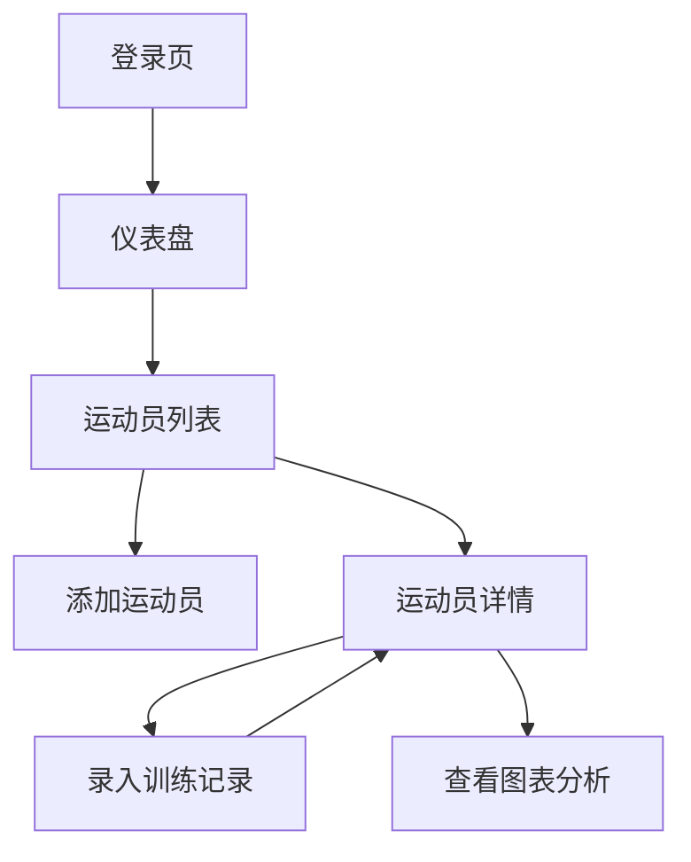

## 1. 产品概述
泳训追踪是一款专为游泳体校教练设计的训练管理工具。教练可以通过邮箱注册登录，管理自己的运动员信息，记录训练数据，并通过可视化图表分析运动员的进步情况。

产品帮助教练系统化地管理运动员训练数据，追踪进步趋势，提高训练效果。目标用户是游泳教练，特别是体校和专业训练机构的教练。

## 2. 核心功能

### 2.1 用户角色
| 角色 | 注册方式 | 核心权限 |
|------|----------|----------|
| 教练 | 邮箱注册 + Clerk认证 | 管理自己的运动员、录入训练记录、查看数据可视化 |

### 2.2 功能模块
应用包含以下主要页面：
1. **登录/注册页**：邮箱密码登录，Clerk认证集成
2. **仪表盘**：教练个人数据概览，快速导航
3. **运动员列表页**：显示教练管理的所有运动员，支持增删改查
4. **运动员详情页**：显示运动员基本信息和历史训练记录，包含数据可视化图表
5. **训练记录录入页**：为指定运动员添加训练记录，包括训练量和各项泳姿成绩

### 2.3 页面详情
| 页面名称 | 模块名称 | 功能描述 |
|-----------|-------------|-------------|
| 登录页 | 认证表单 | 输入邮箱密码进行身份验证，集成Clerk服务 |
| 注册页 | 注册表单 | 创建新账户，验证邮箱有效性 |
| 仪表盘 | 数据概览 | 显示运动员总数、本周训练次数等关键指标 |
| 运动员列表 | 运动员表格 | 列表展示所有运动员，支持搜索筛选，提供添加/编辑/删除操作 |
| 运动员列表 | 添加运动员表单 | 录入姓名、年龄、性别等基本信息 |
| 运动员详情 | 基本信息卡片 | 显示运动员姓名、年龄、性别等基本信息 |
| 运动员详情 | 训练记录表格 | 按日期降序显示历史训练记录，包含训练量和各泳姿成绩 |
| 运动员详情 | 进度图表 | ECharts折线图展示不同泳姿成绩变化趋势 |
| 运动员详情 | 训练量图表 | ECharts柱状图显示每次训练的训练量 |
| 运动员详情 | 进步率计算 | 自动计算并显示相邻两次同一泳姿的进步百分比 |
| 训练记录录入 | 记录表单 | 选择运动员、录入日期、训练量、动态添加多项泳姿成绩 |

## 3. 核心流程
教练使用流程：
1. 教练注册/登录系统
2. 在运动员列表页面添加运动员信息
3. 为运动员录入训练记录，包括训练量和各项泳姿成绩
4. 在运动员详情页面查看历史记录和可视化图表
5. 通过图表分析运动员进步情况，制定训练计划

## 4. 用户界面设计

### 4.1 设计风格
- **主色调**：#0070f3（蓝色体育主题）
- **辅助色**：浅灰色背景，白色卡片
- **按钮样式**：圆角矩形，蓝色主按钮，灰色次按钮
- **字体**：系统默认字体，标题18-24px，正文14-16px
- **布局风格**：卡片式布局，顶部导航栏，响应式网格
- **图标风格**：简洁线性图标，体育相关主题

### 4.2 页面设计概述
| 页面名称 | 模块名称 | UI元素 |
|-----------|-------------|-------------|
| 登录页 | 认证表单 | 居中卡片布局，蓝色主按钮，简洁输入框，支持邮箱验证提示 |
| 仪表盘 | 数据概览 | 网格布局统计卡片，蓝色主题色，清晰的数据指标展示 |
| 运动员列表 | 运动员表格 | 干净的表格设计，操作按钮组，顶部搜索栏，添加按钮 |
| 运动员详情 | 信息展示区 | 顶部基本信息卡片，下方分栏显示记录表格和图表 |
| 训练记录录入 | 表单区域 | 分组表单布局，动态添加泳姿成绩的交互按钮 |

### 4.3 响应式设计
- **桌面优先**：优先设计桌面端体验
- **移动端适配**：支持平板和手机浏览，表格支持横向滚动
- **触摸优化**：按钮和交互元素适合触摸操作

### 4.4 图表设计规范
- **折线图**：不同泳姿使用不同颜色线条，X轴日期，Y轴时间秒数
- **柱状图**：训练量展示，蓝色渐变效果
- **进步率显示**：绿色表示进步，红色表示退步，百分比格式